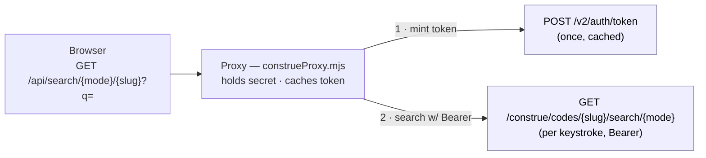

# The API calls

This demo turns plain-language typing into medical codes with **two** PhenoML
Construe calls: authenticate once, then search on every keystroke. Everything
else (React, debounce, ranking, demo fixtures) is just plumbing around these two.

A tiny same-origin proxy (`server/construeProxy.mjs`) holds the credentials and
makes both calls — the browser only ever hits `/api/*`, so the client secret and
Bearer token never reach the page.

```
Browser ──GET /api/search/{mode}/{slug}?q=──▶ Proxy ──┬─▶ POST /v2/auth/token          (once, cached)
                                                       └─▶ GET  /construe/codes/...     (per keystroke, Bearer)
```

## 1. Auth — mint a token (once)

OAuth2 client-credentials. Credentials go in the JSON body; the token is fetched
once, cached with its expiry, and reused across every keystroke (re-minted only
on expiry or a 401).

```http
POST {BASE_URL}/v2/auth/token
Content-Type: application/json

{ "client_id": "...", "client_secret": "..." }
```

```jsonc
// response
{ "access_token": "eyJ...", "expires_in": 3600 }
```

## 2. Search — plain language → codes (per keystroke)

```http
GET {BASE_URL}/construe/codes/{slug}/search/{mode}?{param}={query}&limit=8
Authorization: Bearer {access_token}
```

```jsonc
// response
{ "results": [ { "system": "...", "code": "...", "description": "..." }, ... ] }
```

**Two knobs** — `{slug}` picks the code system, `{mode}` picks how to match:

| Segment    | Values                                                  | Notes                                          |
| ---------- | ------------------------------------------------------- | ---------------------------------------------- |
| `{slug}`   | `ICD-10-CM` · `SNOMED_CT_US_LITE` · `RXNORM` · `LOINC`  | one code system per request                    |
| `{mode}`   | `text` · `semantic`                                     | keyword match vs. natural-language match       |

**The one gotcha** — the query parameter is named differently per mode:

| Mode       | Param  | For                                    | Max length     |
| ---------- | ------ | -------------------------------------- | -------------- |
| `text`     | `q`    | keywords ("chest pain")                | 500 chars      |
| `semantic` | `text` | natural language ("pt c/o SOB on exertion") | 10,000 chars |

## Notable status codes

The proxy maps upstream statuses to typed errors the UI can render:

- `401` → re-auth once and retry; still 401 → auth error
- `404` → code system not found on this instance
- `501` → that search mode isn't configured for this code system
- otherwise `!ok` → generic search failure

## To replicate

1. `POST /v2/auth/token` with your `client_id` / `client_secret`; cache the token.
2. `GET /construe/codes/{slug}/search/{mode}` with `Authorization: Bearer`, using
   `q` for `text` and `text` for `semantic`.
3. Keep both calls **server-side** — never expose the secret or token to the
   browser, and never use a `VITE_` env prefix for secrets (it inlines them into
   the client bundle).

## Diagram

