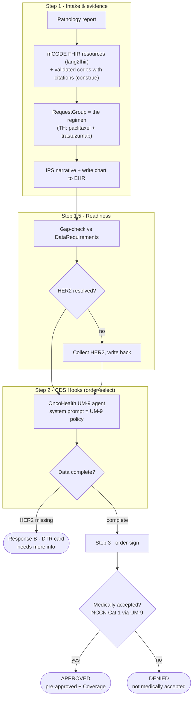

# MOPA Breast-Cancer Prior-Auth Pipeline - a PhenoML reference demo

An end-to-end **medical-oncology prior-authorization (PA) pipeline** built on the [PhenoML Python SDK](https://github.com/PhenoML/phenoml-python-sdk) (**v15**). It is the oncology sibling of the [TMS prior-auth demo](../tms-prior-auth), and shows where PhenoML fits in the CodeX ["Prior Authorization in Medical Oncology"](https://reason-healthcare.github.io/hl7-codex-ocpa/en/) use case under the CMS-0057-F regulatory driver.

**Scenario:** Jane Smith, invasive ductal carcinoma of the right breast, ER- / PR-, clinical Stage IIB (T2 N1 M0). The oncologist orders adjuvant **TH (paclitaxel + trastuzumab)** for 12 weeks. The pathology report documents the diagnosis, stage, and ER/PR, but **HER2 is equivocal (IHC 2+, reflex ISH pending)**, the one data element that decides whether TH is the accepted regimen. PhenoML structures the chart into mCODE FHIR, builds the regimen as a **RequestGroup**, runs a **readiness gap-check**, collects the missing HER2, and hands a clean payload into a **CDS Hooks** exchange where an **OncoHealth UM-9 agent** (its system prompt *is* the [UM-9 policy](./policy_um9_oncohealth.md)) renders the judgment.

**PhenoML's role is Layer 1** (the provider-side, pre-order SMART app): structure unstructured data into conformant FHIR, check it against the payer's data requirements, fill the gaps, then hand off to **Layer 2** (the CDS Hooks exchange). PhenoML is *not* the payer's adjudication engine; the UM-9 agent stands in for the payer CDS judgment. UM-9 is a **meta-policy**: it defines the decision RULE (a regimen is medically accepted if NCCN Category 1-2A, or supported by one of the 5 CMS-recognized compendia, or a listed journal). The demo supplies the regimen's **NCCN category as a structured evidence fact** and the agent applies the rule, so adjudication stays real and citable without reproducing copyrighted NCCN guideline text.



> ⚠️ **For demonstration / education only.** Not medical, billing, or legal advice. The policy text is extracted from a public OncoHealth PDF; always use the current official policy for real decisions.

---

## What's new vs the TMS demo

This demo mirrors the TMS demo's structure, idioms, and `common.py`, and adds four oncology-specific pieces:

1. A thin **FastAPI CDS Hooks shim** we own ([`cds_hooks_server/`](./cds_hooks_server)) - `GET /cds-services` discovery + a `POST /cds-services/oncology-crd` service. No maintained pip CDS Hooks framework exists, so we own a minimal one.
2. A **RequestGroup as the first-class regimen object** (the regimen, not a single drug, is the unit of authorization), hand-assembled with intent / line-of-therapy / disease extensions because `lang2fhir` cannot emit a RequestGroup.
3. The **OncoHealth UM-9 agent**, fed the NCCN **category** as a structured fact (never NCCN text).
4. A **third outcome, DTR / needs-more-info**: a missing data element (HER2) pends the request via a DTR card, instead of the TMS demo's binary approve/deny flip.

---

## Prerequisites

You'll need **Python 3.11+** and a set of PhenoML API credentials.

```bash
python3 -m venv .venv && source .venv/bin/activate    # one venv for the whole demo
pip install -r requirements.txt                       # phenoml (SDK v15+), python-dotenv, httpx, fastapi, uvicorn
cp .env.example .env                                  # then fill in your credentials
python -c "import phenoml; print(phenoml.__version__)"   # confirm v15.x is installed
```

`.env` - the SDK uses **OAuth client credentials** (v15-native):

```
PHENOML_CLIENT_ID=...
PHENOML_CLIENT_SECRET=...

PHENOML_BASE_URL=https://your-instance.app.pheno.ml   # blank = SDK default
PHENOML_FHIR_PROVIDER_ID=<a FHIR provider UUID>        # blank = borrow the first provider
CDS_HOOKS_URL=                                         # blank = run the shim in-process (simulated)
```

> **No FHIR provider id?** Leave `PHENOML_FHIR_PROVIDER_ID` blank - the scripts borrow the first provider from `client.fhir_provider.list()`. Set it explicitly to pin a specific provider.

---

## Run the demo

**Follow along, one phase at a time.** Each script prints its results and hands the chart to the next via a gitignored `.state/` file:

```bash
.venv/bin/python step1_intake.py        # path report → mCODE FHIR → construe codes → RequestGroup → IPS → write to EHR
.venv/bin/python step1_5_readiness.py   # gap-check vs DataRequirements → HER2 missing → collect → write back
.venv/bin/python step2_cdshooks.py      # order-select envelope → Response B (DTR) with HER2 missing, then Response A once resolved
.venv/bin/python step3_ordersign.py     # order-sign → APPROVED (+ Coverage), then a HER2-negative DENY contrast
```

Run them in order the first time (each step reads what the previous one wrote). Re-run any step on its own to iterate - each script creates the agents it needs and **deletes them on exit**. To start over from a clean extraction, re-run with `--fresh` (alias `--reset`), e.g. `.venv/bin/python step1_intake.py --fresh`.

**Or run the whole pipeline at once:**

```bash
.venv/bin/python run_demo.py
```

**Run the CDS Hooks shim live** (optional - the default is simulated/in-process):

```bash
.venv/bin/uvicorn cds_hooks_server.main:app --port 8088
# in another shell:
curl -s localhost:8088/cds-services | python -m json.tool          # discovery document
CDS_HOOKS_URL=http://localhost:8088 .venv/bin/python step2_cdshooks.py   # POST the envelopes over HTTP
```

**Measure it** - accuracy vs labeled gold + decision stability across repeats, for all three outcomes:

```bash
.venv/bin/python evals/run_evals.py --validate     # check the 3 cases, no API calls
.venv/bin/python evals/run_evals.py                # score against the live UM-9 agent
```

> **What success looks like:** Step 1.5 reports HER2 missing and flips `ready` to true after collecting it. Step 2 returns a **DTR card (needs more info)** while HER2 is missing and a **pre-approved card** once it is on file. Step 3 prints **APPROVED** with a Coverage systemAction for HER2-positive and **DENIED** for the HER2-negative contrast. Writing to the EHR (Step 1 and the Step 1.5 HER2 write-back) needs a **dedicated** instance - on a shared instance those writes log `execute_bundle failed (instance may be read-only)` and the rest of the pipeline still runs on the in-memory chart.

---

## Web UI (provider submit + payer review)

The same pipeline, wrapped in a two-persona web app. **Medplum is the EHR / system of record** (reached *through* PhenoML — `client.fhir.*` proxies to the registered FHIR provider); this app only handles the **prior-auth submission and review**. Prior auth is modeled the standard FHIR way: a **Claim** (`use=preauthorization`) is the submission and the payer's queue item, and a **ClaimResponse** (with a **Coverage** on approval) records the decision.

- **Provider view** — paste a pathology report → watch lang2fhir/construe/IPS + the readiness gap-check flag **HER2 missing** → enter the resolved HER2 (written back to the EHR) → **submit** a preauthorization Claim.
- **Payer view** — a **queue** of submitted Claims → open one → get the **OncoHealth UM-9 recommendation** (rebuilds the order-sign CDS Hooks envelope and runs [`cds_hooks_server/evaluate.py`](./cds_hooks_server/evaluate.py)) with rationale + the pre-approval Coverage → **Approve / Deny** (human-in-the-loop; you can override the AI). A **HER2 what-if toggle** flips the receptor status and shows the recommendation change live.

**Backend** ([`ui_server.py`](./ui_server.py)) — reuses the same `.env` credentials and builds the UM-9 + readiness agents **once at startup**:

```bash
.venv/bin/uvicorn ui_server:app --port 8001 --reload    # needs a writable PHENOML_FHIR_PROVIDER_ID for the round-trip
```

**Frontend** ([`ui/`](./ui) — Vite + React + Mantine, mirrors the `demochat` stack):

```bash
cd ui && npm install && npm run dev                     # http://localhost:5173 (proxies /api → :8001)
```

> On a **read-only** FHIR instance the Claim/ClaimResponse writes degrade to a local registry (`.state/claims.json`) so the demo still runs end-to-end; each queue row shows whether it was persisted to Medplum.

---

## What's in this repo

| Path | What it is |
|------|-----------|
| [`step1_intake.py`](./step1_intake.py) | Phase 1 - path report → mCODE FHIR (lang2fhir) → codes with citations (construe) → RequestGroup → IPS → write to EHR |
| [`step1_5_readiness.py`](./step1_5_readiness.py) | Phase 1.5 - readiness gap-check vs the DataRequirements, collect the missing HER2, write it back |
| [`step2_cdshooks.py`](./step2_cdshooks.py) | Phase 2 - assemble the order-select envelope and post it to the oncology-crd service (Response A / B) |
| [`step3_ordersign.py`](./step3_ordersign.py) | Phase 3 - order-sign → pre-approved + Coverage, then a HER2-negative DENY contrast |
| [`run_demo.py`](./run_demo.py) | Runs all four phases in one process |
| [`pipeline.py`](./pipeline.py) | Return-based intake + readiness logic (shared by the step scripts and the web backend) |
| [`ui_server.py`](./ui_server.py) | FastAPI backend for the web UI — intake / submit / queue / recommendation / decision |
| [`pa_fhir.py`](./pa_fhir.py) | Prior-auth persistence: Claim / ClaimResponse / Coverage builders + Medplum read/write with a read-only fallback |
| [`ui/`](./ui) | The provider + payer web app (Vite + React + Mantine) |
| [`common.py`](./common.py) | Shared config/auth/helpers + the `.state/` artifact store the steps pass data through (reused from the TMS demo) |
| [`cds_hooks_server/main.py`](./cds_hooks_server/main.py) | The FastAPI CDS Hooks shim - discovery + the oncology-crd service |
| [`cds_hooks_server/evaluate.py`](./cds_hooks_server/evaluate.py) | The judgment: resolve the Library, check DataRequirements, call the UM-9 agent, build the cards |
| [`evals/run_evals.py`](./evals/run_evals.py) | The accuracy + determinism scorecard (three outcomes) |
| [`evals/cases/`](./evals/cases) | Labeled cases: approve-th-her2pos, deny-her2neg, dtr-her2-missing |
| [`policy_um9_oncohealth.md`](./policy_um9_oncohealth.md) | OncoHealth UM-9 + Medicare hierarchy - loaded verbatim as the agent's prompt |
| [`mopa_requirements.json`](./mopa_requirements.json) | Breast-cancer DataRequirement[] (a flattened Library) |
| [`regimen_th.json`](./regimen_th.json) | The TH RequestGroup template + intent / line / disease extensions |
| `sample_path_report.txt` | Jane Smith's pathology report (HER2 deliberately equivocal/pending) |

**Shared vs dedicated instances:** shared instances allow FHIR `GET` + per-resource `POST`; `PUT`/`PATCH`/`DELETE`/Bundle need a dedicated instance. The gap-check, CDS Hooks evaluation, and adjudication all run anywhere - they operate on the in-memory chart, so only the EHR write-back degrades on a shared instance.

---

## Deferred (out of scope here, noted for a future task)

- **Authoring the real oncology StructureDefinitions.** The demo feeds the IG profile *elements* to `lang2fhir` as natural language and hand-assembles the RequestGroup with demo placeholder extension URLs. Authoring the real `OncologyLineOfTherapy` / `OncologyDataRequirementsLibrary` profiles via `lang2fhir.upload_profile` is deferred to a future FHIR-skill task. The LOINC codes in `mopa_requirements.json` are representative and should be confirmed against the LOINC browser before any non-demo use.
- **The payer CQL path.** A real payer CDS service runs CQL, which PhenoML does not support yet. The UM-9 agent stands in for that judgment; a future CQL → natural language → PhenoML Workflow path is deferred.
