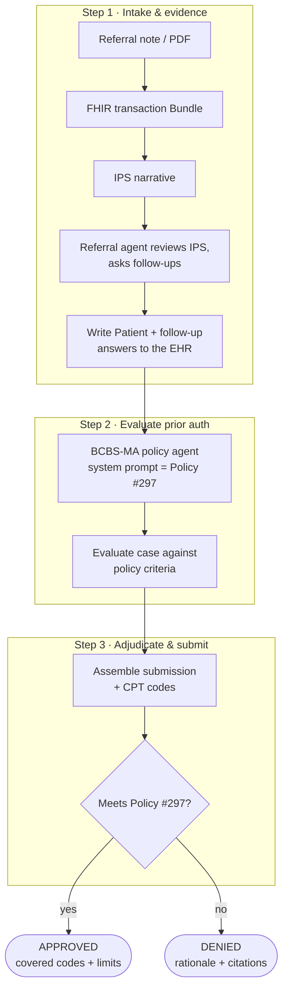

# TMS Prior-Auth Pipeline — a PhenoML course demo

An end-to-end **payer prior-authorization pipeline** built on the [PhenoML Python SDK](https://github.com/PhenoML/phenoml-python-sdk) (**v15**), packaged as a two-part course.

**Scenario:** a patient with treatment-resistant depression is referred for **repetitive transcranial magnetic stimulation (rTMS)**. We ingest the referral, build an International Patient Summary, have a **referral agent** review it and ask follow-ups, write the answers back to the EHR, then run the case past a **BCBS-Massachusetts policy agent** (its system prompt *is* [Medical Policy #297](./policy_297_tms.md)) to evaluate the prior auth and adjudicate the claim.

> ✅ **Every snippet in this course was executed end-to-end against a live PhenoML instance (SDK `15.0.3`).**



> ⚠️ **For demonstration / education only.** Not medical, billing, or legal advice. The policy text is extracted from a public BCBS-MA PDF; always use the current official policy for real decisions.

---

## This course

The walkthrough is split into two modules. Each keeps all the runnable code and layers **"predict-first" exercises** on top — every answer is hidden behind a `▸ Reveal` toggle, so commit to a prediction before you open it.

1. **[Part 1 — Building the Agents](./part-1-building-agents.md)**
   Build the **referral intake agent** and the **BCBS-MA policy #297 agent**, evaluate a prior auth, watch a decision **flip** when the evidence changes, and adjudicate APPROVED/DENIED. Capstone: port the pipeline to a different policy.

2. **[Part 2 — Determinism & Evals](./part-2-determinism-evals.md)**
   Measure whether the judgment layer is **correct** (vs. labeled gold) and **consistent** (stable across repeats), read the scoring code, and grow the eval case set. Capstone: introduce a regression and prove the eval catches it. *(Runs standalone — the harness builds its own throwaway agent.)*

> The full end-to-end pipeline — including **document→FHIR extraction**, **IPS generation**, and **writing answers back to the EHR** — runs as three follow-along step scripts (`step1_intake.py` → `step2_evaluate.py` → `step3_adjudicate.py`) or all at once via [`run_demo.py`](./run_demo.py). See **[Run the demo](#run-the-demo)** below. Part 1 starts from a ready-made patient summary so it can focus on the agents; those data-integration steps live in `step1_intake.py`.

---

## Prerequisites

You'll need **Python 3.11+** and a set of PhenoML API credentials.

```bash
python3 -m venv .venv && source .venv/bin/activate    # one venv for the whole demo
pip install -r requirements.txt                       # phenoml (SDK v15+), python-dotenv, httpx
cp .env.example .env                                  # then fill in your credentials
```

`.env` — the SDK uses **OAuth client credentials** (v15-native):

```
PHENOML_CLIENT_ID=...
PHENOML_CLIENT_SECRET=...

PHENOML_BASE_URL=https://your-instance.app.pheno.ml   # blank = SDK default
PHENOML_FHIR_PROVIDER_ID=<a FHIR provider UUID>        # blank = borrow the first provider
```

> **No FHIR provider id?** Leave `PHENOML_FHIR_PROVIDER_ID` blank — the scripts borrow the first provider from `client.fhir_provider.list()` and print which one they used. Set it explicitly to pin a specific provider.

The course modules (Part 1 / Part 2) run **top to bottom in one Python session**; the scripts below run under the same `.venv`.

---

## Run the demo

Two ways to run the pipeline, both under the `.venv` you just set up.

**Follow along, one phase at a time.** Each script prints its results and hands the chart to the next via a gitignored `.state/` file:

```bash
.venv/bin/python step1_intake.py      # referral note → FHIR bundle → IPS → referral agent → write to EHR
.venv/bin/python step2_evaluate.py    # BCBS-MA policy #297 agent evaluates the case — watch it flip when evidence drops
.venv/bin/python step3_adjudicate.py  # extract CPT codes, adjudicate an APPROVED case then a DENIED one
```

Run them in order the first time (step 2 reads what step 1 wrote). Re-run any step on its own to iterate — each script creates the agents it needs and **deletes them on exit**, so nothing is left behind. To start over from a clean extraction, re-run with `--fresh` (alias `--reset`) — e.g. `.venv/bin/python step1_intake.py --fresh`. That works from any directory, unlike `rm -rf .state/`: the cache is anchored to the script, so it always lives in `tms-prior-auth/.state/` no matter where you run from.

**Or run the whole pipeline at once:**

```bash
.venv/bin/python run_demo.py
```

**Measure it (Part 2)** — accuracy vs. labeled gold + decision stability across repeats:

```bash
.venv/bin/python evals/run_evals.py --validate     # check the cases, no API calls
.venv/bin/python evals/run_evals.py                # score against the live policy agent
```

> **What success looks like:** step 2 reports `meets_criteria: true` on the full evidence and flips to `false` once the psychotherapy answer is dropped; step 3 prints `APPROVED` for the complete submission and `DENIED` for the mild-MDD case. Writing to the EHR in step 1 needs a **dedicated** instance — on a shared instance that one step logs `execute_bundle failed (instance may be read-only)` and the rest still run (see the instance note at the bottom).

---

## What's in this repo

| Path | What it is |
|------|-----------|
| [`part-1-building-agents.md`](./part-1-building-agents.md) | Course module 1 — build & run the agents |
| [`part-2-determinism-evals.md`](./part-2-determinism-evals.md) | Course module 2 — measure accuracy & stability |
| [`step1_intake.py`](./step1_intake.py) | Phase 1 — referral note → FHIR bundle → IPS → referral agent → write to EHR |
| [`step2_evaluate.py`](./step2_evaluate.py) | Phase 2 — BCBS-MA policy #297 agent evaluates the prior auth (+ the evidence flip) |
| [`step3_adjudicate.py`](./step3_adjudicate.py) | Phase 3 — extract CPT codes and adjudicate APPROVED / DENIED |
| [`run_demo.py`](./run_demo.py) | Runs all three phases in one process |
| [`common.py`](./common.py) | Shared config/auth/helpers + the `.state/` artifact store the steps pass data through |
| [`evals/run_evals.py`](./evals/run_evals.py) | The determinism + accuracy scorecard |
| [`evals/cases/`](./evals/cases) | Labeled prior-auth cases (one JSON each) |
| [`policy_297_tms.md`](./policy_297_tms.md) | BCBS-MA Medical Policy #297 — loaded verbatim as the payer agent's prompt |
| `sample_referral_note.txt` | Sample clinical referral used by `step1_intake.py` |

**Shared vs dedicated instances:** shared instances allow FHIR `GET` + per-resource `POST`; `PUT`/`PATCH`/`DELETE`/Bundle need a dedicated instance. The course paths run anywhere.
